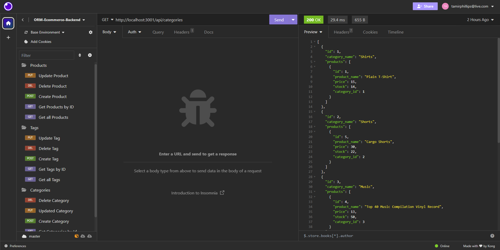

# Project Information

In this challenge, I created a back-end for an e-commerce site using Sequelize(MySQL) in order to GET, UPDATE, DELETE, and CREATE
specific data(products, categories, etc) based on the site.

## Acceptance Criteria

GIVEN a functional Express.js API
WHEN I add my database name, MySQL username, and MySQL password to an environment variable file
THEN I am able to connect to a database using Sequelize
WHEN I enter schema and seed commands
THEN a development database is created and is seeded with test data
WHEN I enter the command to invoke the application
THEN my server is started and the Sequelize models are synced to the MySQL database
WHEN I open API GET routes in Insomnia for categories, products, or tags
THEN the data for each of these routes is displayed in a formatted JSON
WHEN I test API POST, PUT, and DELETE routes in Insomnia
THEN I am able to successfully create, update, and delete data in my database

### Live website and repo

https://github.com/TamirP123/orm-ecommerce-back-end

#### Photo of application

#### Video Walthrough

https://drive.google.com/file/d/1c2wTvsZUtNx613vltAV7S6qaaE4awWzG/view
